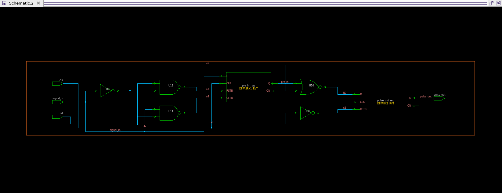
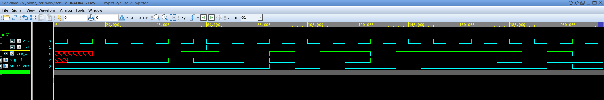
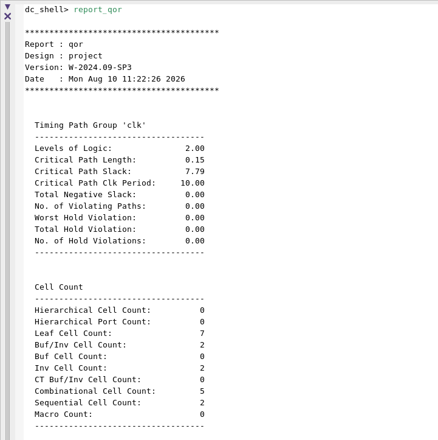
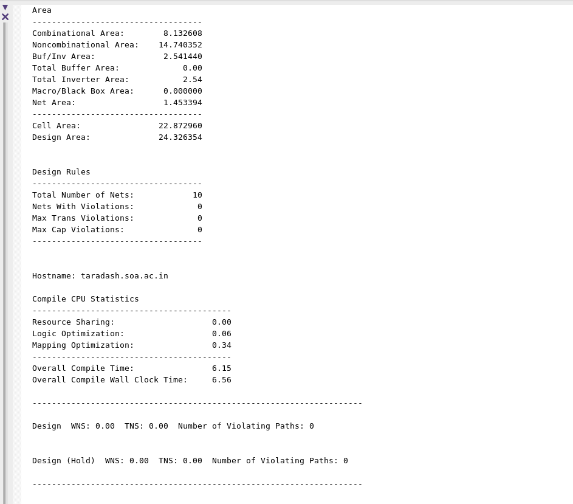

# 🚀 Rising Edge Pulse Generator Design, Verification, and Synthesis

> **Author:** Mahesh Kumar Sahoo ||  
> **For Proper Documentation read :** MAHESH_Rising_Edge_Pulse_Generator.pdf

Welcome to the Rising Edge Pulse Generator project repository! This project demonstrates the end-to-end RTL design, verification, and ASIC logic synthesis of a synchronous edge detection architecture.

## 🧰 EDA Tools Used
* **RTL Simulation & Verification:** Synopsys VCS
* **Waveform Viewing & Debugging:** Synopsys Verdi
* **ASIC Logic Synthesis & Timing Analysis:** Synopsys Design Compiler

## 📖 Introduction
A Rising Edge Pulse Generator (also known as an Edge Detector) is a fundamental digital logic circuit designed to produce a single-clock-cycle pulse whenever an input signal transitions from logic LOW (0) to logic HIGH (1). 
* **Simplicity:** It requires minimal logic (typically a few Flip-Flops and a logic gate) to reliably detect signal transitions.
* **How it works:** The circuit operates by comparing the current state of an input signal against its previous state (delayed by one clock cycle). A pulse is generated exclusively when the current state is high and the previous state was low.
* **Applications:** Widely used in push-button debouncing, interrupt generation, synchronizing asynchronous external signals to a internal clock domain, and triggering state machine transitions.

## ⚙️ Working
The architecture is inherently synchronous, driven by a common system clock. The design is cleanly divided into the following functional blocks:

### Edge Detection Logic 🔍
* Employs a D-Flip-Flop to store the state of the synchronized input from the previous clock cycle.
* Uses combinatorial logic to evaluate the transition.
* **Equation:** `pulse_out = current_state & ~previous_state`
* Generates a precise, glitch-free one-clock-cycle pulse exactly when the rising edge occurs.

*Caption: Figure  - Synthesized RTL.*

## 🛠️ Verification
The design was robustly verified using a SystemVerilog/UVM testbench environment, simulated with Synopsys VCS and Verdi.

* **Components:** The testbench includes a stimulus generator capable of driving various input signal patterns, including rapid toggling, long holding delays, and single-cycle spikes.
* **Scoreboard Logic:** The Scoreboard continuously monitors the input transitions and validates that `pulse_out` is asserted for exactly one clock cycle immediately following a valid 0-to-1 transition. Mismatches are flagged and logged in the terminal output.

For Scoreboard Terminal output open images/project_verdi1.png in any text editor or notepad

## 📊 Output
The design successfully detected rising edges and generated the synchronized single-cycle pulses as intended.

### 🌊 Simulation Waveforms

*Caption: Figure  - Simulation waveform verifying the 0-to-1 input transition and the corresponding single-cycle output pulse.*

### TestCase Verification

*Caption: Figure  - Simulation waveform verifying reset, all high input signal and toggling input signal.*

### 🔬 Synthesis & Static Timing Analysis
The ASIC synthesis workflow utilized the Synopsys Design Compiler with a standard cell library.

* **Timing Closure:** Achieved setup timing closure with zero violating paths, ensuring reliable high-frequency operation.
* **Cell Area & Power:** The footprint is minimal, utilizing only a few standard sequential and combinational cells, making it highly optimized for low-power operation.

*Caption: Figure - QOR Report obtained from Synopsys Design Compiler.*

## 🎯 Conclusion
The project successfully completed the RTL design, verification, and ASIC logic synthesis of a Rising Edge Pulse Generator. The implementation ensures robust transition detection suitable for high-speed synchronous digital systems.

**Future Enhancements:**
* Extending the design to support configurable Falling Edge and Dual Edge (Both Edges) detection.
* Parameterizing the output pulse width (e.g., generating an N-cycle pulse instead of a single cycle).
* Integrating configurable glitch-filtering and debouncing counters directly into the input stage to handle noisy mechanical switches.
